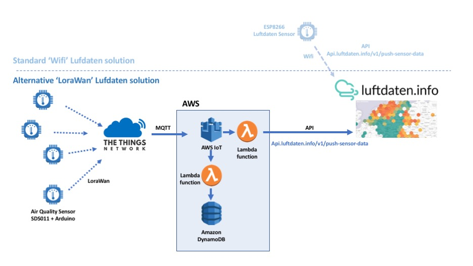
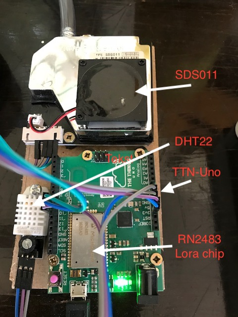
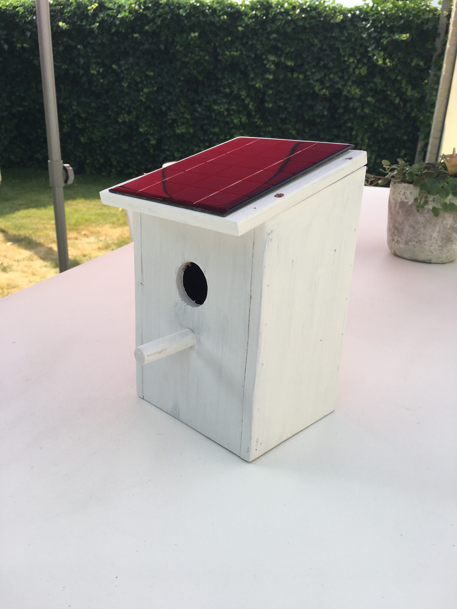

# Lora Sensor for Luftdaten 
## Architecture: TTN - AWS - Luftdaten 

## Sensor prototype

## Sensor via TTN(LoraWan)
### 1. Goal and concept

The goal is to make a 'LoraWan' version of the 'standard' Luftdaten wifi sensor based on ESP8266 but now with LoraWan communication instead of wifi.

The standard wifi based esp8266 will be replaced by a LoraWan enabled sensor. As protype we choose the 'Things Uno' (TTN-Uno) from 'The Things Network'

The 'air quality' sensor , SDS011, is unchanged from the original design. But now needs to interact with the TTN-uno instead of the ESP8266.

reference:
  - https://luftdaten.info
  - https://luftdaten.info/en/construction-manual/
  - https://www.thethingsnetwork.org/docs/devices/uno/
  
The 'sensor data' from the SDS011 has to be send via a API to Luftdaten. This is achieved in the original design in the ESP8266. Logical since wifi is tcp/ip. In order to achieve 'Power efficient' (sleeping) devices in LoraWan, it has a 'lean' LoraWan protocol that doesn't support tcp/ip, so we have to invoke the API further in the communication chain. 

This can be achieved in many ways: 

- simplest way is to realize this is inside 'The Things Network' back-end. But the donwnside is a lack of control and very limited storage.
- second option is AWS. This is a small extra step but offers and opens up the almost limitless functionality and power of AWS.

### 2. Components

#### 2.1 SDS011
  - This is the standard Luftdaten sensor. This very affordable sensor (17 euro) measures particles of 2.5 and 10 microns. The advantage of this sensor is that it measures relatively accurate and since it is the defacto 'standard sensor' on the Luftdaten platform, all measurements compare relatively well.\
https://luftdaten.info/en/construction-manual/
  

#### 2.2 TTN
  - The Things Network (TTN) is a decentralized open and crowdsourced Iot data platform based on LoraWan. End users are invited to connect their 'Lora Gateway'(the equivalent of a wifi accesspoint) to the  TTN back-end at no cost. On the other hand can the community and every sensor use every 'Lora Gateway'. This way everybody benefits and the coverage of this open community network increases.\
https://www.thethingsnetwork.org/

#### 2.3 AWS
  - AWS: Amazon Web Services is a cloud based platform that is, relatively easy, affordable, pay as you grow, very secure and offers unprecedented functionality that goes beyond the wildest dreams of most IT professionals.\
  https://aws.amazon.com/

#### 2.4 Luftdaten
  - Luftdaten is an initiative of 'OK Lab Stuttgart', part of Code for Germany. Their goal is to promote transparency development, open data and citizen science.
  The Luftdaten project offers a platform for 'Air Quality sensors' around the world, thus giving the community an open view on this subject, meanwhile sensibilizing participants.
  - The Luftdaten (defacto) sensor is based around a esp8266 and the actual SDS011 measuring component. The website offers a kit list and fool-proof assembling instuctions. This way every non-technical person can build their own sensor and contribute to the network. The only (small) downside is the need for wifi and power. 
  This is the reason why we took the challenge to offer a Lora alternative for sensor locations where power and wifi are not so obvious.\
https://luftdaten.info

### 3. Work in progress
  - A bird called Lora:  or 'Solar Powered Dust Sensor'

  

### 4. Things to do
- Battery measurement.
- Lowpower Arduino instead of the Leonardo based TTN-Uno arduino.
- Industrial enclosure :-)
`
